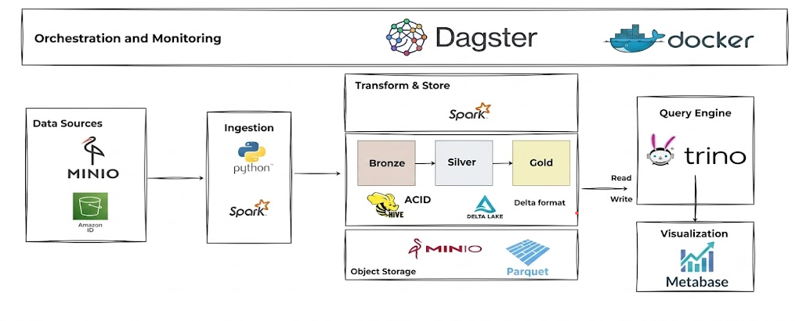
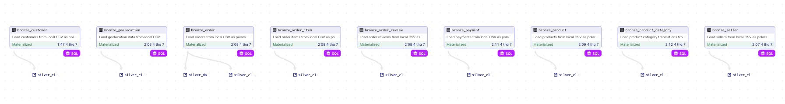
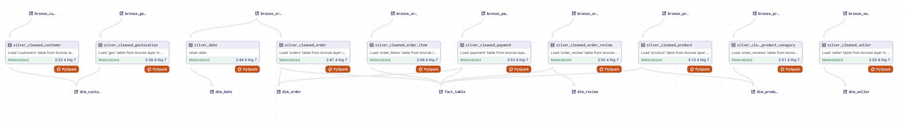
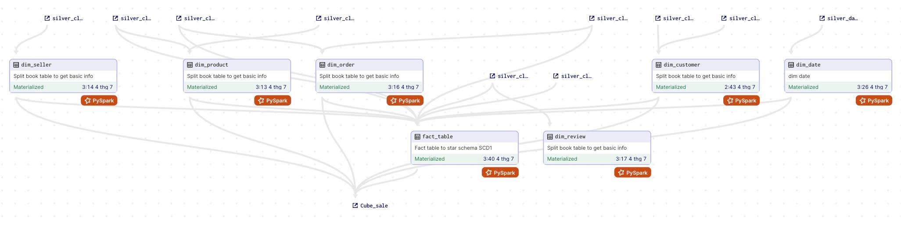

# XÂY DỰNG DATA LAKEHOUSE ĐỂ PHÂN TÍCH DỮ LIỆU THƯƠNG MẠI ĐIỆN TỬ

### Kiến trúc hệ thống

### Luồng dữ liệu
+ Bronze:

+ Silver:

+ Gold:

### Trực quan hóa dữ liệu
+ Dashboard Quản lý đơn hàng

+ Dashboard Hiệu suất sản phẩm

+ Dashboard Quản lý bán hàng và khách hàng
